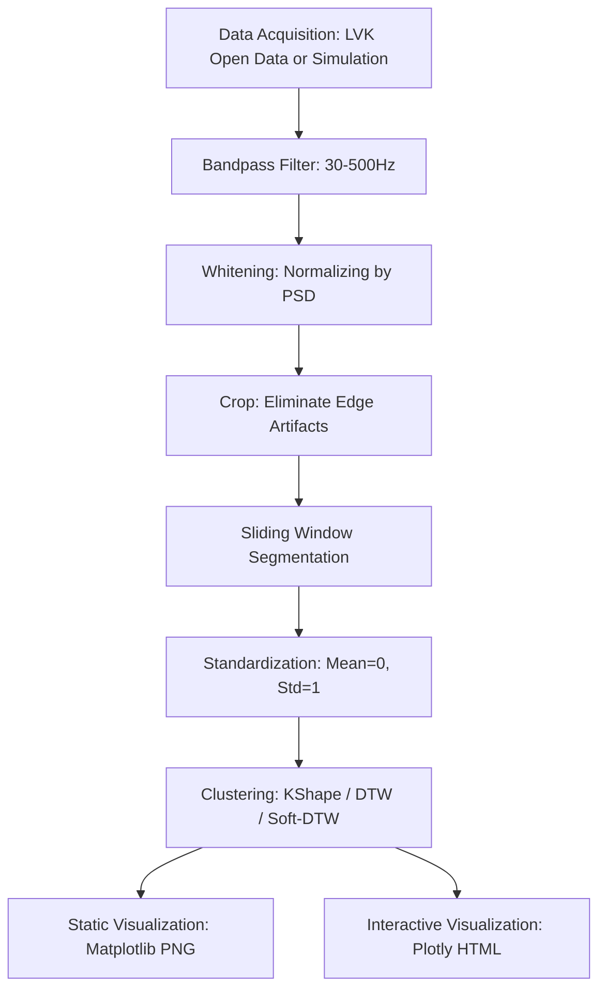
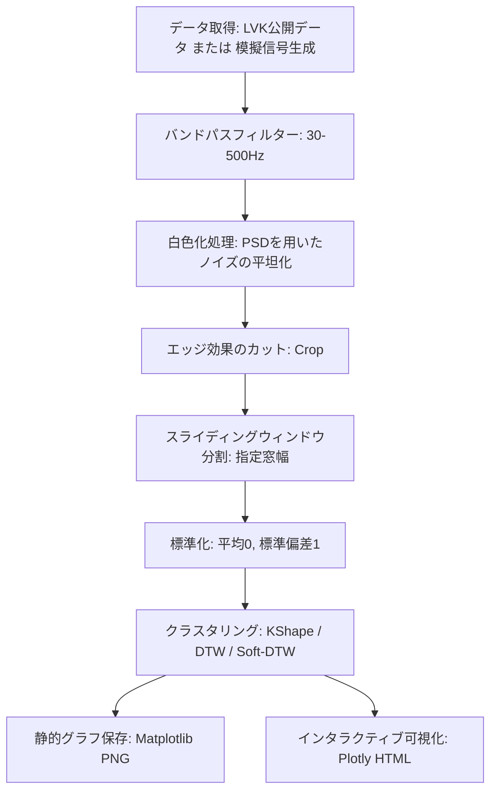

# Gravitational Wave Time-Series Clustering (Advanced Version)

Language / 言語: **[English Version](#english-version)** | **[日本語版](#japanese-version)**

---

<a name="english-version"></a>
# English Version

[](https://colab.research.google.com/github/kojikoji81/DTW_GravitationalWaves/blob/main/DTW_GravitationalWaves_Notebook.ipynb)

This repository contains an advanced Python pipeline for fetching open gravitational wave (GW) strain data from the LIGO/Virgo/KAGRA (LVK) detectors, applying physical signal preprocessing (bandpass filtering and PSD-based whitening), and automatically categorizing waveforms using time-series clustering algorithms: **KShape (Shape-Based Distance)** and **TimeSeriesKMeans (Dynamic Time Warping / Soft-DTW)**.

---

## Astrophysical and Scientific Significance

Applying unsupervised time-series clustering to gravitational wave strain data holds substantial value in modern astrophysics and gravitational wave data analysis.

### 1. Instrumental Noise "Glitch" Classification
Gravitational wave detectors are the most sensitive measuring devices on Earth, capable of detecting spacetime distortions smaller than a ten-thousandth of a proton's width. However, this extreme sensitivity means they are constantly plagued by transient, non-Gaussian noise artifacts known as **"Glitches"**. Glitches can be caused by seismic activity, laser scattering, hardware calibration, or power fluctuations. 
Because glitches often mimic actual GW signals (like black hole mergers), identifying and classifying them is crucial for reducing false-alarm rates. Clustering algorithms like KShape (SBD) and DTW automatically group these glitches by their shape, allowing instrumental scientists to isolate and mitigate the hardware or environmental sources causing them.

### 2. Search for Unmodeled Gravitational Wave Bursts
The standard search for gravitational waves from compact binary coalescences (CBC) relies on **Matched Filtering**, which matches data against a pre-calculated template bank of templates computed from General Relativity. 
However, Matched Filtering cannot detect waves from sources with unmodeled or highly uncertain physics, such as core-collapse supernovae, cosmic string cusps, or unknown astronomical sources. Unsupervised clustering serves as a **blind search tool**, grouping recurring similar waveforms without any prior theoretical template, paving the way for discovering new, unexpected physical phenomena in the universe.

### 3. Spacetime Strain Reconstruction via Whitening
LVK strain data is dominated by colored noise, where low-frequency seismic noise is orders of magnitude stronger than high-frequency signals. **Whitening** (normalizing by the Power Spectral Density, PSD) is not just a mathematical scaling; it physically inverts the detector's frequency-dependent transfer function.
This flattens the noise spectrum, revealing the physical spacetime strain. Only after whitening can astronomers reconstruct the astrophysical properties of the source—such as the black hole masses, orbital spin, and inspiral evolution—directly from the waveform's geometry.

---

## Data Processing Pipeline

The following flow diagram illustrates the data preprocessing, window segmentation, clustering, and visualization pipeline:



---

## Key Features

1. **Preset LVK Event Data & Fallback Simulation**:
   - Fetches real strain data from GWOSC for major historical events (e.g., `GW150914`, `GW170817`) automatically based on preset parameters.
   - If offline or data-fetch fails, it generates a high-quality simulated dataset combining chirp signals (inspirals), multi-frequency sinusoids, and Gaussian noise.

2. **Advanced Metrics & Algorithms**:
   - **KShape (SBD distance)**: Shift-invariant cross-correlation metric utilizing FFT, enabling extremely fast shape-based clustering.
   - **TimeSeriesKMeans (DTW / Soft-DTW)**: Accounts for non-linear temporal expansions or compressions. Uses multi-threaded computations (`n_jobs=-1`).

3. **Interactive & High-Resolution Visualization**:
   - Generates high-DPI static subplots (`plots/gw_dtw_clustering.png`) representing each cluster centroid.
   - Generates interactive Plotly subplots (`plots/gw_dtw_clustering_interactive.html`), allowing users to zoom in, pan, and hover over individual sequences to view metadata (e.g., GPS timestamps).

4. **Rigorous Theoretical Notebook**:
   - A fully documented, LaTeX-supported Jupyter Notebook demonstrating mathematical derivations for whitening, SBD cross-correlation, and KShape Rayleigh quotient optimization. Compatible with Google Colab.

---

## Directory Structure

- `DTW_GW.py`: Main executable Python script with command-line interface.
- `DTW_GravitationalWaves_Notebook.ipynb`: Mathematical theory and interactive demonstration notebook.
- `requirements.txt`: Python package dependencies.
- `.gitignore`: Configured to keep local run-logs (`ai-work-logs.md`), project rules (`GEMINI.md`), and python environments local.
- `plots/`: Output directory containing generated figures (auto-created).

---

## Installation & Usage

### 1. Installation
We recommend using Python 3.10+. Install the dependencies using pip:

```bash
pip install -r requirements.txt
```

If you use the `uv` package manager:
```bash
uv pip install -r requirements.txt
```

### 2. Execution

#### Run Demo Simulation
```bash
python DTW_GW.py
```

#### Run KShape on the GW150914 Event
```bash
python DTW_GW.py --event GW150914 --method kshape --clusters 3
```

#### Run DTW on the GW170817 Event
```bash
python DTW_GW.py --event GW170817 --method dtw --clusters 3
```

#### Command-Line Arguments
- `--event`: Name of preset LVK event (`GW150914`, `GW151226`, `GW170104`, `GW170814`, `GW170817`).
- `--gps`: Starting GPS time (ignored if `--event` is set).
- `--duration`: Duration of data in seconds (default: `5.0`).
- `--detector`: LVK Detector (`H1`, `L1`, `V1`).
- `--method`: Clustering method (`kshape`, `dtw`, `softdtw`).
- `--clusters`: Number of clusters (default: `3`).
- `--win-len`: Sliding window length in seconds (default: `0.5`).
- `--step-len`: Sliding window step size in seconds (default: `0.5`).
- `--max-seq`: Limit for maximum sequences to cluster (default: `30`).
- `--whiten` / `--no-whiten`: Enable/disable whitening (default: `True`).

---

## Theoretical Study
For mathematical derivations and custom parameters, open the [DTW_GravitationalWaves_Notebook.ipynb](DTW_GravitationalWaves_Notebook.ipynb) in Jupyter or run it directly on Google Colab using the badge at the top.

---
---

<a name="japanese-version"></a>
# 日本語版

[](https://colab.research.google.com/github/kojikoji81/DTW_GravitationalWaves/blob/main/DTW_GravitationalWaves_Notebook.ipynb)

LIGO/Virgo/KAGRA (LVK) の公開重力波時系列データを取得し、物理学的な信号前処理（バンドパスフィルターおよびPSDに基づく白色化処理）を適用した上で、時系列データ特有の類似度評価アルゴリズムである **KShape (SBD: Shape-Based Distance)** や **TimeSeriesKMeans (DTW: 動的時間伸縮法 / Soft-DTW)** を用いて、波形パターンを自動的に分類・可視化するための高度な解析パイプラインです。

---

## 物理学的・科学的な意義

時系列クラスタリングを重力波のストレインデータに適用することには、現代の宇宙物理学および重力波データ解析において極めて重要な3つの意義があります。

### 1. 検出器の天敵である「グリッチ（突発ノイズ）」の自動識別と分類
重力波検出器は、陽子の大きさの1万分の1以下という極限的な時空の歪みを測定する、地球上で最も精密な装置です。しかしその超高感度ゆえに、地面の振動、レーザーの散乱、懸架ワイヤーの振動、制御回路の急激な電圧変化などに起因する突発的な非ガウス性ノイズ**「グリッチ (Glitch)」**に常に悩まされています。
グリッチはしばしばブラックホール合体などの本物の重力波信号と非常によく似た波形を呈するため、誤検出を引き起こす最大の要因になります。本パイプラインに実装された KShape (SBD) や DTW を用いてグリッチをその「形状」に基づいて自動分類することで、装置科学者がノイズ源を特定・排除し、重力波観測の信頼性を保証するための決定的な支援を行います。

### 2. 理論モデルが存在しない「未知のバースト重力波」の探索
標準的な重力波探索では、一般相対性理論から予測された波形（テンプレート）をあらかじめ何万通りも用意し、データと照合する**テンプレートマッチング（Matched Filtering）**が主流です。
しかし、超新星爆発や未知の宇宙現象など、事前に理論的な波形モデルを予測することが不可能な現象（バースト重力波）に対してはテンプレートマッチングは機能しません。本ツールの「教師なし学習（クラスタリング）」は、事前のテンプレートなしに「似た形状が集まっている未知のグループ」を自動で発見できるため、**アインシュタインの理論を超えた、未知の物理現象や新しい天体を発見する**ための「ブラインド探索ツール」として不可欠です。

### 3. 白色化（Whitening）による「物理情報の復元」
検出器が記録する生のストレインデータは有色ノイズであり、低周波の地面振動などが高周波の重力波信号を完全に覆い隠しています。白色化（Power Spectral Density, PSD による規格化）は単なるデータスケーリングではなく、**「検出器が持つ感度の偏り（周波数特性）を逆算し、背後にある物理的な時空の歪み（重力波波形）を復元する」**という物理的意味を持ちます。白色化を適用して初めて、ブラックホールの質量や orbital spin、合体直前の進化といった天体物理パラメータを波形の形状から正確に引き出すことが可能になります。

---

## データ処理パイプライン

重力波データの取得から前処理、クラスタリング、可視化までの流れは、以下のパイプラインに沿って実行されます。



---

## 主な機能と特徴

1. **プリセットイベント対応と自動デモフォールバック**:
   - `GW150914` や `GW170817` などの有名な歴史的重力波イベントを指定するだけで、GWOSCから本物のデータを自動取得。
   - オフライン環境やデータ取得失敗時は、チャープ信号（インスパイラル波形）、サイン波、ガウスノイズを混合した高品質なシミュレーションデータを自動で生成して動作します。

2. **高度な距離尺度とアルゴリズム**:
   - **KShape (SBD距離)**: 時間シフト（位相のズレ）を許容し、FFTを用いて非常に高速に動作する形状ベースの手法。
   - **TimeSeriesKMeans (DTW / Soft-DTW)**: 時間軸の非線形な伸縮を補正。マルチスレッド (`n_jobs=-1`) による並列計算に対応。

3. **充実した可視化出力**:
   - Matplotlib による各クラスタのセントロイド（代表波形）と属する時系列の一覧静的プロット（`plots/gw_dtw_clustering.png`）。
   - Plotly を用いた、Webブラウザ上で拡大・縮小、各系列データのGPS時刻などをホバー確認できるインタラクティブHTMLプロット（`plots/gw_dtw_clustering_interactive.html`）。

4. **詳細な理論解説 Jupyter Notebook**:
   - 白色化、SBD相互相関、KShapeにおけるレイリー商の固有値問題への帰着など、数学的証明をLaTeXで**行間を省略せずに詳細に記述**した Notebook が同梱されています。Google Colab で直接実行可能です。

---

## フォルダ構成

- `DTW_GW.py`: メインの実行スクリプト（コマンドライン引数による設定変更に対応）。
- `DTW_GravitationalWaves_Notebook.ipynb`: 詳細な数学的理論解説とデモコードを含む Jupyter Notebook。
- `requirements.txt`: 実行に必要なPythonパッケージ一覧。
- `.gitignore`: ローカルでの実行ログ (`ai-work-logs.md`) やルール (`GEMINI.md`)、仮想環境をリポジトリから除外する設定。
- `plots/`: 可視化グラフの保存先ディレクトリ（自動生成されます）。

---

## 環境構築と実行方法

### 1. 依存ライブラリのインストール
Python 3.10 以上の環境を推奨します。以下のコマンドで必要なライブラリをインストールします。

```bash
pip install -r requirements.txt
```

または、高速パッケージマネージャ `uv` を使用する場合：
```bash
uv pip install -r requirements.txt
```

### 2. スクリプトの実行

#### デフォルト実行 (シミュレーションデモデータを使用)
```bash
python DTW_GW.py
```

#### 実イベント `GW150914` を使用して KShape でクラスタリング
```bash
python DTW_GW.py --event GW150914 --method kshape --clusters 3
```

#### 実イベント `GW170817` を使用して DTW でクラスタリング
```bash
python DTW_GW.py --event GW170817 --method dtw --clusters 3
```

#### コマンド引数オプション一覧
- `--event`: 既知の重力波イベント名（`GW150914`, `GW151226`, `GW170104`, `GW170814`, `GW170817`）
- `--gps`: 開始GPS時刻 (デフォルト: 1240000000。event指定時は無視されます)
- `--duration`: 取得するデータ長（秒） (default: `5.0`)
- `--detector`: 検出器名 (H1, L1, V1) (default: `H1`)
- `--method`: アルゴリズム (`kshape`, `dtw`, `softdtw`)
- `--clusters`: クラスタ数 (default: `3`)
- `--win-len`: ウィンドウ長さ（秒） (default: `0.5`)
- `--step-len`: ウィンドウのステップ幅（秒） (default: `0.5`)
- `--max-seq`: 分析に使用する最大シーケンス数制限 (default: `30`)
- `--whiten` / `--no-whiten`: 白色化処理を有効/無効にする (default: `True`)

---

## 理論的背景の学習
詳細な数式の展開や理論的な導出、アプローチごとの動作比較については、同梱の [DTW_GravitationalWaves_Notebook.ipynb](DTW_GravitationalWaves_Notebook.ipynb) を Jupyter / Google Colab で開いてご参照ください。
